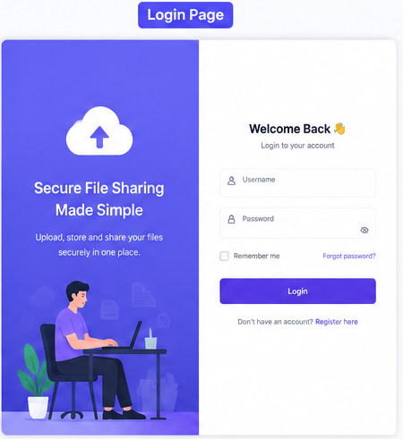
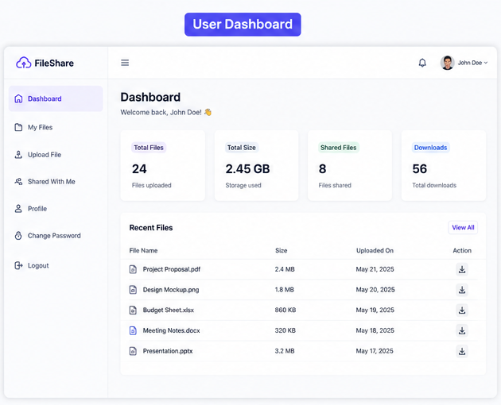
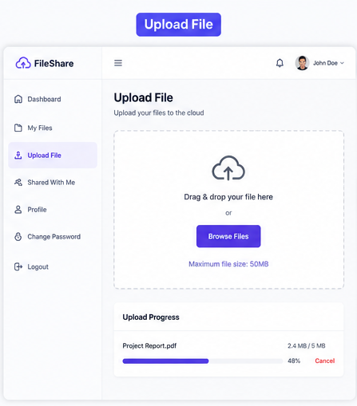
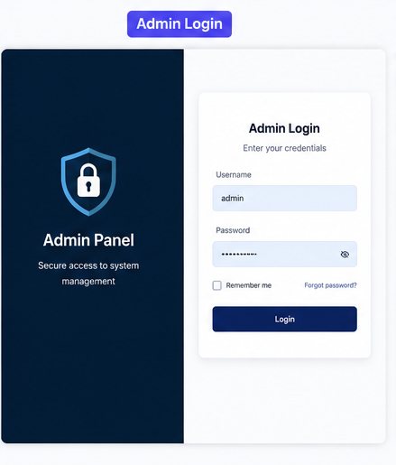
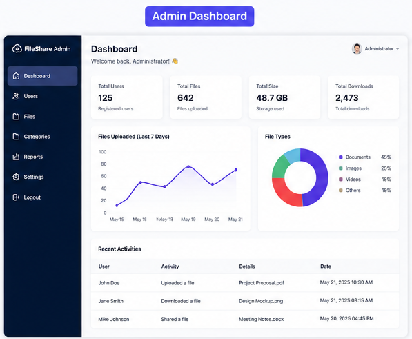
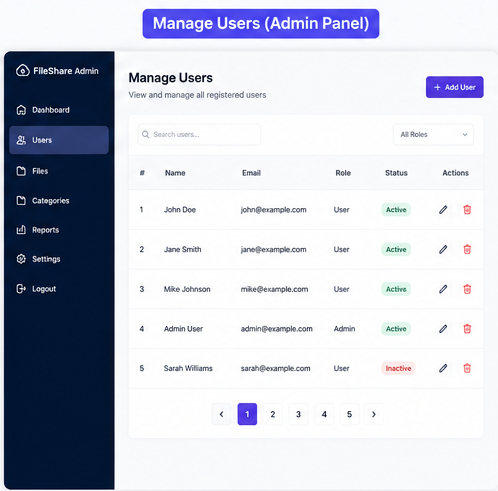

# 🔐 XAuth

### Modern Authentication & Secure File Management System

A role-based authentication system built with **Java Servlets**, **JSP**, and **MySQL**, providing secure user authentication, file management, and administrative controls through a clean and intuitive web interface.

---

# 📖 About

**XAuth** is a secure authentication and file management platform that enables users to upload, organize, and manage files while giving administrators complete control over users, files, categories, and system management.

Designed with a clean and responsive interface, XAuth separates **User** and **Administrator** roles, ensuring secure access and efficient management throughout the application.

---

# ✨ Features

## 👤 User Features

* Secure Login Authentication
* Personal Dashboard
* Upload Files
* Download Files
* Shared Files
* Change Password
* Profile Management
* Session Management

---

## 👑 Administrator Features

* Admin Authentication
* Admin Dashboard
* User Management
* File Management
* Category Management
* Reports & Analytics
* System Administration

---

# 📸 Screenshots

## User Login

---

## User Dashboard

---

## Upload Files

---

## Admin Login

---

## Admin Dashboard

---

## User Management

---

# 🛠️ Tech Stack

| Technology    | Usage                     |
| ------------- | ------------------------- |
| Java          | Backend Development       |
| JSP           | Dynamic Web Pages         |
| Java Servlets | Business Logic            |
| HTML5         | Frontend Structure        |
| CSS3          | Styling                   |
| JavaScript    | Client-side Functionality |
| Bootstrap     | Responsive Design         |
| MySQL         | Database                  |
| Apache Tomcat | Web Server                |

---

# 🎯 Highlights

* Secure Authentication System
* Role-Based Access Control
* Responsive User Interface
* File Upload & Download
* User & Admin Dashboards
* Administrative Control Panel
* Organized Project Architecture
* Easy Deployment on Apache Tomcat

---

# 🚀 Future Improvements

* Google Authentication
* Two-Factor Authentication (2FA)
* Email Verification
* Password Recovery
* JWT Authentication
* Activity Logs
* Cloud Storage Integration
* PostgreSQL / Supabase Support
* Dark Mode
* REST API

---

# 📄 License

This project is intended for educational and portfolio purposes.

---

## 👨‍💻 Author

### **Toyakant Chaudhary**

*"Building secure, scalable, and modern web applications."*

⭐ If you found this project helpful, consider giving it a **Star** on GitHub!

